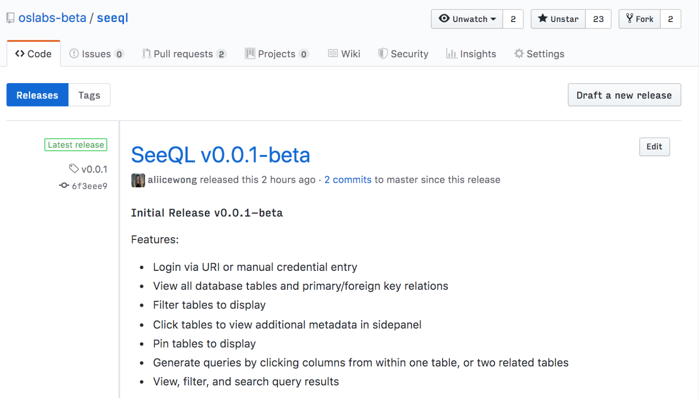

# SeeQL

_Alice Wong | Ariel Hyman | Kate Matthews | Tyler Sayles_

---

  

  Problem 1: database GUIs for relational databases look
  like this
  

  

---

  

  Problem 2: most of the software belongs to a "closed source" community :~)
  

  

---

  
 Problem 3: Karen from Compliance 

  
or: "Simple" Queries ASAP!!!!1!!!

  

---

<h1 style={{ color: 'red' }}>
  <em>Kill</em> Karen!
</h1>

<aside> or... </aside>

---

  
Download SeeQL!

  

---