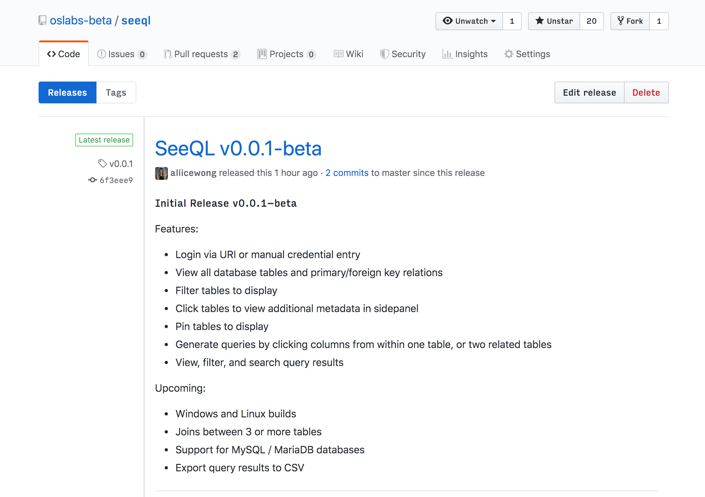

# SeeQL

_Alice Wong | Ariel Hyman | Kate Matthews | Tyler Sayles_

---

# Problem 1

database GUIs for relational databases look like this (taken earlier today, in the year 2019 AD)


---

# Problem 2

they represent a "closed source" community :~)


---

# Problem 3

"Simple" SQL queries

```
with graph as (
  select c1.table_name t1, c2.table_name t2
  from all_constraints c1
    join all_constraints c2
      on c1.owner = c2.r_owner
      and c1.constraint_name = c2.r_constraint_name
  where c1.owner = 'TEST' union all select c2.table_name t1,
  c1.table_name t2 from all_constraints c1 join all_constraints c2 on c1.owner = c2.r_owner and c1.constraint_name =
  c2.r_constraint_name where c1.owner = 'TEST'), paths as (
  select sys_connect_by_path(t1, '#') || '#' path
  from graph connect by nocycle prior t1 = t2), -- "subgraph" are all those directed paths that go trough
-- a given table T_AUTHOR subgraph as ( select distinct t.table_name, regexp_replace(p.path, '^#(.*)#$', '\1') path from paths p
  cross join all_tables t
  where t.owner = 'TEST'
  and p.path like '%#' || t.table_name || '#%'
),
-- This XML-trick splits paths and generates rows for every distinct
-- table name
split_paths as (
select distinct table_name origin,
  cast(t.column_value.extract('//text()') as varchar2(4000))
  table_names from subgraph, table(xmlsequence(xmltype( '<x><x>' || replace(path, '#', '</x><x>') ||
'</x></x>').extract('//x/*'))) t
),
-- "table_graphs" lists every table and its associated graph
table_graphs as ( select origin, count(*) graph_size, listagg(table_names, ', ')
within group (order by 1) table_names from split_paths group by origin
)
select origin, graph_size "SIZE", dense_rank() over (order by table_names) id, table_names from table_graphs
order by origin
```

---

# Problem 4

Karen from Compliance


---

# solution

<h1 style={{ color: 'red' }}>
<em>Kill</em> Karen!
 </h1>

 or...

---

# solution



---